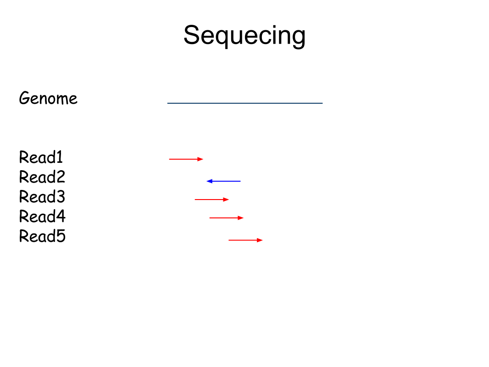
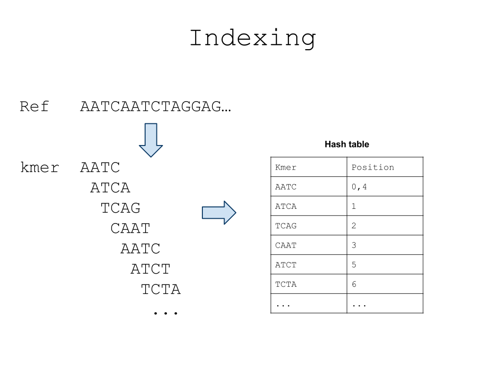
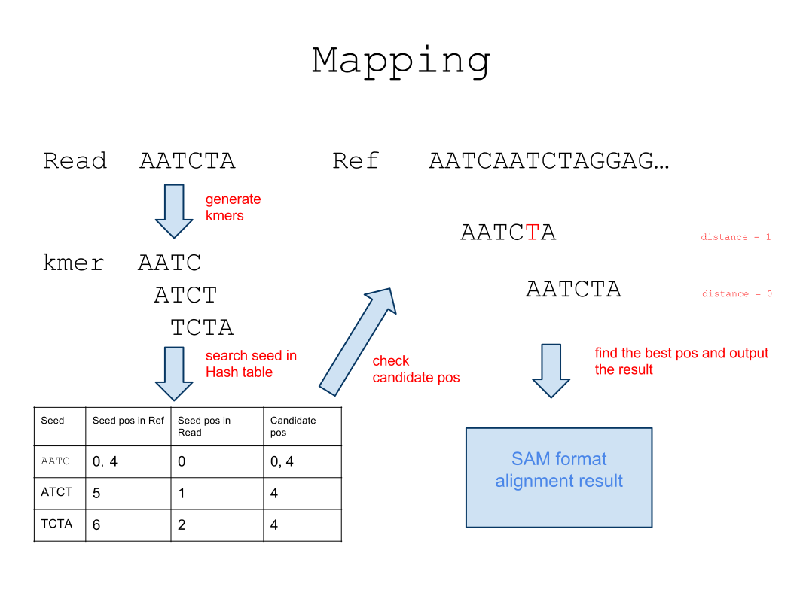

[DNA-mapping](http://ngstrainingclass.github.io/DNA-mapping)
===========

实现一个DNA mapping工具
##1. 生物学背景
DNA mapping是重测序问题的必要步骤，同时也是发现变异的最简单的手段。详细内容参考[wiki](http://en.wikibooks.org/wiki/Next_Generation_Sequencing_(NGS)/Alignment)的Introduction部分。
##2. 问题描述
Given：
>1.  Reference序列（由'A'、'C'、'G'、'T' 4种字符组成的字符串，以**Fasta**格式给出。）
>2.  Reads序列(一个由很多'A'、'C'、'G'、'T' 4种字符组成的字符串集合，以**Fastq**格式给出。)

Return：
>每个Read在Reference的最佳([海明距离][1]最小)比对位置，以**HIT**格式输出。

##3. 基于Hash表的比对算法

##4. 数据格式
###Fasta格式
标准genome和read存储格式。更多内容参考[wiki](http://en.wikipedia.org/wiki/FASTA_format)。

**实例:**

说明|实例  
------| -----
序列名称  | \>Reference1 
序列| AATTAGGACACACAAGAGCACACAGGAacaTAGcag
序列名称  | \>Reference2 
序列| AATTAGGACACataAAGAGCACACAGGAacaTAGcag
...|...

###Fastq格式
标准read存储格式。更多内容参考[wiki](http://en.wikipedia.org/wiki/FASTQ_format)

**实例:**

说明|实例  
------| -------
序列名称  | @Read1
序列| AATTAGGACACACAAGAGCACACAGGAacaTAGcag
标志符号  | +
质量数| 2222222222222222222222222222222222222222
序列名称  | @Read2
序列| AAACACACAAGAGCACACAGGAacaTAGcagaaaaat
标志符号  | +
质量数| 2222222222222222222222222222222222222222
...|...

###SAM格式
标准比对结果输出格式。跟多内容参考[文档](http://samtools.github.io/hts-specs/SAMv1.pdf)。
###HIT格式
这不是标准比对结果格式。
对SAM格式做了简化，只保留了最重要的部分。

**实例:**

序列名称|方向(+/—)|比对位置(从1开始)|序列|质量数  
------| -------| -------| -------| -------
Read1|+|23 |ATCCAGGATGAG |222222222222
Read2|—|56 |GTCCAGGATGAG |222222222222  
...|...|...|...|...

##5. 补充阅读
##6. 参考文献

[1]: http://en.wikipedia.org/wiki/Hamming_distance
